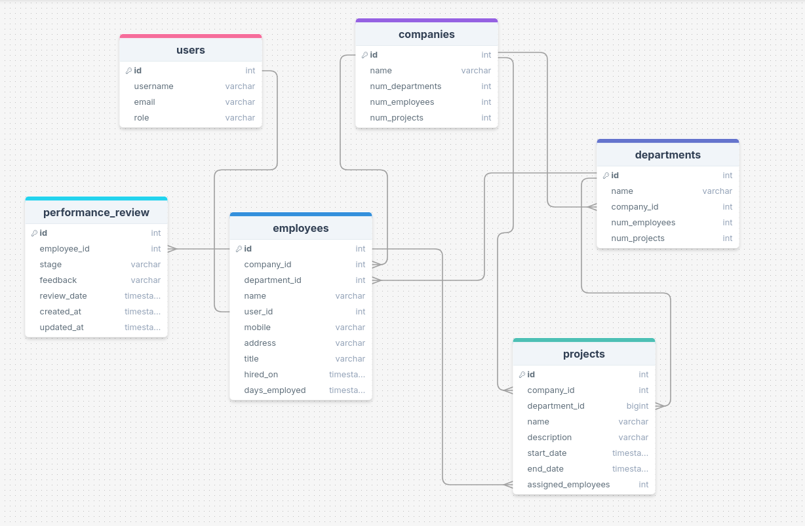

# Company Management System
encompasses various features for managing companies, departments, employees, and projects.

## Fearures 
- [x] Secure authentication and role-based access control with roles (Admin, Manager, Employee).
- [x] CRUD operations for *companies*, including automatic calculation of department, employee, and project counts.
- [x] CRUD operations for *departments* linked to specific companies.
- [x] CRUD operations for *employees* with details such as name, department, contact information, and job title.
- [x] CRUD operations for *projects* linked to specific companies and departments.
- [x] Structured review process with stages and allowed transitions:
  -  Pending Review, Review Scheduled, Feedback Provided, Under Approval, Review Approved, and Review Rejected.
- [x] Unit and integration tests to validate functionality.

## Data Models: 
- 

## Security & Permissions:
- 1. Workflow: Employee Performance Review Cycle
       - only **managers and admins** can change the stage of review
       - only **managers and admins** can provide feadback
       - only employee can view his own feadbacks
- 2. APIs
     - Company -> any user can retrieve and list all comanies exist, only admin can create, update and delete a company's data
     - Department -> any user can retrieve and list all departments exist, only admin can create, update and delete a department's data
     - Employee -> each employee can update and retrive his own data, **only managers and admins** can create and delete employee's data
     - Project -> any employee can only retirve the project that assigns to him, only **only managers and admins** can create, update and delete project's data
    
## Setup:
- Prerequisites: python, docker
- create virtual environment
```py
python -m venv .venv
source .venv/bin/activate
```
- clone repo
```py
git clone https://github.com/dohaelsawy/company_management_system.git
cd company_management_system
```
- create in root of the project `.env` file to store configs, and specify the following of env
```
DB_ENGINE=django.db.backends.postgresql
DB_NAME=cms_db
DB_USER=postgres
DB_PASSWORD=cms_password
DB_HOST=db
DB_PORT=5432
```
- run docker-compose
```
docker-compose up
```
- congrats it's working, navigate to the following path `http://0.0.0.0:8000/user/login/`

## tests
- run tests using `make test`
## future work
- [ ] swagger
- [ ] logging
- [ ] emojy in readme file
